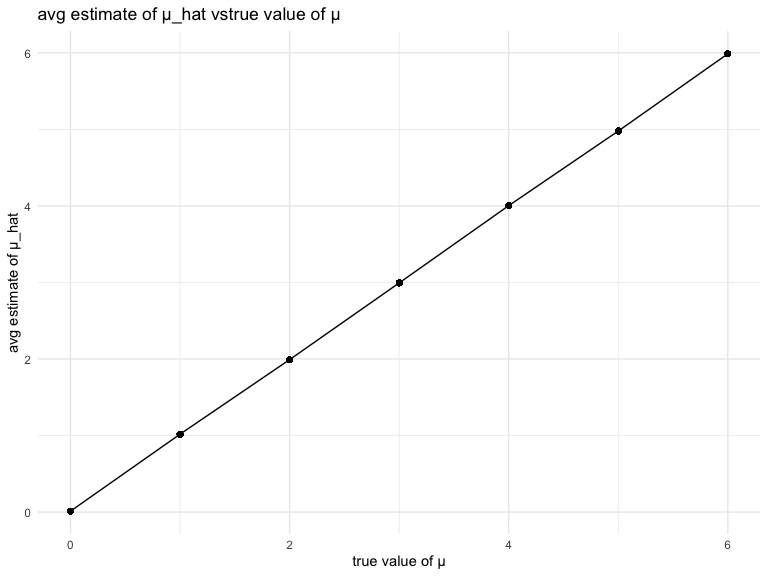

Homework 5
================
Nhu Nguyen
2023-11-16

## problem 1

importing & cleaning dataset

``` r
homicide_df = 
  read_csv("data/homicide-data.csv", na = c("", "NA", "Unknown")) %>%
  mutate(
    city_state = str_c(city, state, sep = ", "),
    resolution = case_when(
      disposition == "Closed without arrest" ~ "unsolved",
      disposition == "Open/No arrest"        ~ "unsolved",
      disposition == "Closed by arrest"      ~ "solved"
    )
  ) %>% 
  filter(city_state != "Tulsa, AL") 
```

    ## Rows: 52179 Columns: 12
    ## ── Column specification ────────────────────────────────────────────────────────
    ## Delimiter: ","
    ## chr (8): uid, victim_last, victim_first, victim_race, victim_sex, city, stat...
    ## dbl (4): reported_date, victim_age, lat, lon
    ## 
    ## ℹ Use `spec()` to retrieve the full column specification for this data.
    ## ℹ Specify the column types or set `show_col_types = FALSE` to quiet this message.

**description:** The resulting dataframe has 52178 entries, on variables
that include the victim name, race, age, and sex, reported homicide
date, and location of homicide. During my cleaning process, I created a
variable, `city_state`, that included both city and state and a
`resolution` variable to indicate if the case was closed via arrest. I
excluded Tulsa, AL as it is not a major US city and is most likely a
data entry error.

grouping by city to find total number of homicides and number of solved
cases

``` r
city_homicide_df = 
  homicide_df %>% 
  select(city_state, disposition, resolution) %>% 
  group_by(city_state) %>% 
  summarize(
    hom_total = n(),
    hom_unsolved = sum(resolution == "unsolved"))
```

obtaining estimate and CI for proportion of unsolved homicide in
Baltimore, MD

``` r
bmore_test = 
  prop.test(
    x = filter(city_homicide_df, city_state == "Baltimore, MD") %>% pull(hom_unsolved),
    n = filter(city_homicide_df, city_state == "Baltimore, MD") %>% pull(hom_total)) 

broom::tidy(bmore_test) %>% 
  knitr::kable(digits = 3)
```

| estimate | statistic | p.value | parameter | conf.low | conf.high | method                                               | alternative |
|---------:|----------:|--------:|----------:|---------:|----------:|:-----------------------------------------------------|:------------|
|    0.646 |   239.011 |       0 |         1 |    0.628 |     0.663 | 1-sample proportions test with continuity correction | two.sided   |

using `purr` package to get estimates and CIs for proportion of unsolved
homicide

``` r
test_results = 
  city_homicide_df %>% 
  mutate(
    prop_tests = map2(hom_unsolved, hom_total, \(x, y) prop.test(x = x, n = y)),
    tidy_tests = map(prop_tests, broom::tidy)) %>% 
  select(-prop_tests) %>% 
  unnest(tidy_tests) %>% 
  select(city_state, estimate, conf.low, conf.high) %>% 
  mutate(city_state = fct_reorder(city_state, estimate))
```

plotting results

``` r
test_results %>% 
  mutate(city_state = fct_reorder(city_state, estimate)) %>% 
  ggplot(aes(x = city_state, y = estimate)) + 
  geom_point() + 
  geom_errorbar(aes(ymin = conf.low, ymax = conf.high)) + 
  theme(axis.text.x = element_text(angle = 90, hjust = 1))
```


There is a wide range in which the rates of homicides are solved.
Chicago appears to have a high estimate, and given the narrow CI, it is
likely that it is the location of many homicides.

## problem 2

``` r
names_df =
  tibble(
    files = list.files("data/"),
    path = str_c("data/", files)) |> 
  mutate(data = map(path, read_csv)) |> 
  unnest()
```

    ## Rows: 1 Columns: 8
    ## ── Column specification ────────────────────────────────────────────────────────
    ## Delimiter: ","
    ## dbl (8): week_1, week_2, week_3, week_4, week_5, week_6, week_7, week_8
    ## 
    ## ℹ Use `spec()` to retrieve the full column specification for this data.
    ## ℹ Specify the column types or set `show_col_types = FALSE` to quiet this message.
    ## Rows: 1 Columns: 8
    ## ── Column specification ────────────────────────────────────────────────────────
    ## Delimiter: ","
    ## dbl (8): week_1, week_2, week_3, week_4, week_5, week_6, week_7, week_8
    ## 
    ## ℹ Use `spec()` to retrieve the full column specification for this data.
    ## ℹ Specify the column types or set `show_col_types = FALSE` to quiet this message.
    ## Rows: 1 Columns: 8
    ## ── Column specification ────────────────────────────────────────────────────────
    ## Delimiter: ","
    ## dbl (8): week_1, week_2, week_3, week_4, week_5, week_6, week_7, week_8
    ## 
    ## ℹ Use `spec()` to retrieve the full column specification for this data.
    ## ℹ Specify the column types or set `show_col_types = FALSE` to quiet this message.
    ## Rows: 1 Columns: 8
    ## ── Column specification ────────────────────────────────────────────────────────
    ## Delimiter: ","
    ## dbl (8): week_1, week_2, week_3, week_4, week_5, week_6, week_7, week_8
    ## 
    ## ℹ Use `spec()` to retrieve the full column specification for this data.
    ## ℹ Specify the column types or set `show_col_types = FALSE` to quiet this message.
    ## Rows: 1 Columns: 8
    ## ── Column specification ────────────────────────────────────────────────────────
    ## Delimiter: ","
    ## dbl (8): week_1, week_2, week_3, week_4, week_5, week_6, week_7, week_8
    ## 
    ## ℹ Use `spec()` to retrieve the full column specification for this data.
    ## ℹ Specify the column types or set `show_col_types = FALSE` to quiet this message.
    ## Rows: 1 Columns: 8
    ## ── Column specification ────────────────────────────────────────────────────────
    ## Delimiter: ","
    ## dbl (8): week_1, week_2, week_3, week_4, week_5, week_6, week_7, week_8
    ## 
    ## ℹ Use `spec()` to retrieve the full column specification for this data.
    ## ℹ Specify the column types or set `show_col_types = FALSE` to quiet this message.
    ## Rows: 1 Columns: 8
    ## ── Column specification ────────────────────────────────────────────────────────
    ## Delimiter: ","
    ## dbl (8): week_1, week_2, week_3, week_4, week_5, week_6, week_7, week_8
    ## 
    ## ℹ Use `spec()` to retrieve the full column specification for this data.
    ## ℹ Specify the column types or set `show_col_types = FALSE` to quiet this message.
    ## Rows: 1 Columns: 8
    ## ── Column specification ────────────────────────────────────────────────────────
    ## Delimiter: ","
    ## dbl (8): week_1, week_2, week_3, week_4, week_5, week_6, week_7, week_8
    ## 
    ## ℹ Use `spec()` to retrieve the full column specification for this data.
    ## ℹ Specify the column types or set `show_col_types = FALSE` to quiet this message.
    ## Rows: 1 Columns: 8
    ## ── Column specification ────────────────────────────────────────────────────────
    ## Delimiter: ","
    ## dbl (8): week_1, week_2, week_3, week_4, week_5, week_6, week_7, week_8
    ## 
    ## ℹ Use `spec()` to retrieve the full column specification for this data.
    ## ℹ Specify the column types or set `show_col_types = FALSE` to quiet this message.
    ## Rows: 1 Columns: 8
    ## ── Column specification ────────────────────────────────────────────────────────
    ## Delimiter: ","
    ## dbl (8): week_1, week_2, week_3, week_4, week_5, week_6, week_7, week_8
    ## 
    ## ℹ Use `spec()` to retrieve the full column specification for this data.
    ## ℹ Specify the column types or set `show_col_types = FALSE` to quiet this message.
    ## Rows: 1 Columns: 8
    ## ── Column specification ────────────────────────────────────────────────────────
    ## Delimiter: ","
    ## dbl (8): week_1, week_2, week_3, week_4, week_5, week_6, week_7, week_8
    ## 
    ## ℹ Use `spec()` to retrieve the full column specification for this data.
    ## ℹ Specify the column types or set `show_col_types = FALSE` to quiet this message.
    ## Rows: 1 Columns: 8
    ## ── Column specification ────────────────────────────────────────────────────────
    ## Delimiter: ","
    ## dbl (8): week_1, week_2, week_3, week_4, week_5, week_6, week_7, week_8
    ## 
    ## ℹ Use `spec()` to retrieve the full column specification for this data.
    ## ℹ Specify the column types or set `show_col_types = FALSE` to quiet this message.
    ## Rows: 1 Columns: 8
    ## ── Column specification ────────────────────────────────────────────────────────
    ## Delimiter: ","
    ## dbl (8): week_1, week_2, week_3, week_4, week_5, week_6, week_7, week_8
    ## 
    ## ℹ Use `spec()` to retrieve the full column specification for this data.
    ## ℹ Specify the column types or set `show_col_types = FALSE` to quiet this message.
    ## Rows: 1 Columns: 8
    ## ── Column specification ────────────────────────────────────────────────────────
    ## Delimiter: ","
    ## dbl (8): week_1, week_2, week_3, week_4, week_5, week_6, week_7, week_8
    ## 
    ## ℹ Use `spec()` to retrieve the full column specification for this data.
    ## ℹ Specify the column types or set `show_col_types = FALSE` to quiet this message.
    ## Rows: 1 Columns: 8
    ## ── Column specification ────────────────────────────────────────────────────────
    ## Delimiter: ","
    ## dbl (8): week_1, week_2, week_3, week_4, week_5, week_6, week_7, week_8
    ## 
    ## ℹ Use `spec()` to retrieve the full column specification for this data.
    ## ℹ Specify the column types or set `show_col_types = FALSE` to quiet this message.
    ## Rows: 1 Columns: 8
    ## ── Column specification ────────────────────────────────────────────────────────
    ## Delimiter: ","
    ## dbl (8): week_1, week_2, week_3, week_4, week_5, week_6, week_7, week_8
    ## 
    ## ℹ Use `spec()` to retrieve the full column specification for this data.
    ## ℹ Specify the column types or set `show_col_types = FALSE` to quiet this message.
    ## Rows: 1 Columns: 8
    ## ── Column specification ────────────────────────────────────────────────────────
    ## Delimiter: ","
    ## dbl (8): week_1, week_2, week_3, week_4, week_5, week_6, week_7, week_8
    ## 
    ## ℹ Use `spec()` to retrieve the full column specification for this data.
    ## ℹ Specify the column types or set `show_col_types = FALSE` to quiet this message.
    ## Rows: 1 Columns: 8
    ## ── Column specification ────────────────────────────────────────────────────────
    ## Delimiter: ","
    ## dbl (8): week_1, week_2, week_3, week_4, week_5, week_6, week_7, week_8
    ## 
    ## ℹ Use `spec()` to retrieve the full column specification for this data.
    ## ℹ Specify the column types or set `show_col_types = FALSE` to quiet this message.
    ## Rows: 1 Columns: 8
    ## ── Column specification ────────────────────────────────────────────────────────
    ## Delimiter: ","
    ## dbl (8): week_1, week_2, week_3, week_4, week_5, week_6, week_7, week_8
    ## 
    ## ℹ Use `spec()` to retrieve the full column specification for this data.
    ## ℹ Specify the column types or set `show_col_types = FALSE` to quiet this message.
    ## Rows: 1 Columns: 8
    ## ── Column specification ────────────────────────────────────────────────────────
    ## Delimiter: ","
    ## dbl (8): week_1, week_2, week_3, week_4, week_5, week_6, week_7, week_8
    ## 
    ## ℹ Use `spec()` to retrieve the full column specification for this data.
    ## ℹ Specify the column types or set `show_col_types = FALSE` to quiet this message.
    ## Rows: 52179 Columns: 12
    ## ── Column specification ────────────────────────────────────────────────────────
    ## Delimiter: ","
    ## chr (9): uid, victim_last, victim_first, victim_race, victim_age, victim_sex...
    ## dbl (3): reported_date, lat, lon
    ## 
    ## ℹ Use `spec()` to retrieve the full column specification for this data.
    ## ℹ Specify the column types or set `show_col_types = FALSE` to quiet this message.

``` r
p2_df =
  names_df |> 
  mutate(
    files = str_replace(files, ".csv", ""),
    arm = str_sub(files, 1, 3),
    ID = str_sub(files, 5, 7)) |> 
  pivot_longer(
    week_1:week_8,
    names_to = "week",
    values_to = "observation",
    names_prefix = "week_") |> 
  mutate(week = as.numeric(week)) |> 
  select(arm, ID, week, observation)
```

making spaghetti plot !

``` r
p2_df |> 
  ggplot(aes(x = week, y = observation, color = ID)) +
  geom_line() +
  facet_wrap(~arm) +
  labs(x = "week", y = "observations", title = "observations of subjects over time")
```


In the control arm, participants had no marked increase or decrease in
observation values. the control arm observation values mainly stayed
between -1.25 and 3.75. However in the experimental arm, there was
(generally) an increase in values over the course of the study period (8
weeks). in week 0, the range of values was around -1.25 to 3.75 and but
week 8, the valyes fell within 2.5 to 7.5.

## problem 3

setting elements & generating datasets

``` r
sim_mean = function(mu) {
  data = tibble(
    x = rnorm(n=30, mean = mu, sd = 5),
  )
output = data |>
  t.test() |>
  broom::tidy() |>
  select(estimate, p.value) |>
  rename(mu_hat=estimate, pval=p.value)
}
```

repeating for mu = 1, 2, 3, 4, 5, 6

``` r
sim_results = expand_grid(
  mu_df = c(0, 1, 2, 3, 4, 5, 6),
  iter = 1:5000
) |>
  mutate(
    estimate = map(mu_df, sim_mean)
  ) |>
  unnest(estimate)
```

number of times null was rejected & true value of mu on plot

``` r
sim_results |>
  group_by(mu_df) |> 
  summarise(
    reject = sum(pval < 0.05),
    proport = reject/5000) |> 
  ggplot(aes(x = mu_df, y = proport)) +
  geom_point() +
  geom_line() +
  labs(x = "true value of μ", y = "power", title = "power of test vs true value of μ")
```


